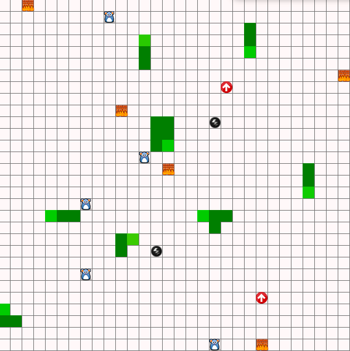

### Escuela Colombiana de Ingeniería
## Arquitecturas de Software - ARSW

#### Laboratorio - Programación concurrente, condiciones de carrera, esquemas de sincronización, colecciones sincronizadas y concurrentes.

Ejercicio inividual o en parejas.

### Part I

Parte I – Antes de terminar la clase.

Control de hilos con [wait/notify.](http://howtodoinjava.com/core-java/multi-threading/how-to-work-with-wait-notify-and-notifyall-in-java/)

1.  Descargue el proyecto
    [*PrimeFinder*](https://github.com/ARSW-ECI/wait-notify-excercise).
    Este es un programa que calcula números primos entre 0 y M
    (Control.MAXVALUE), concurrentemente, distribuyendo la búsqueda de
    los mismos entre n (Control.NTHREADS) hilos independientes.

2.  Se necesita modificar la aplicación de manera que cada t
    milisegundos de ejecución de los threads, se detengan todos los
    hilos y se muestre el número de primos encontrados hasta el momento.
    Luego, se debe esperar a que el usuario presione ENTER para reanudar
    la ejecución de los mismos. Utilice los mecanismos de sincronización
    provistos por el lenguaje (wait y notify, notifyAll).

Tenga en cuenta:

-   La construcción synchronized se utiliza para obtener acceso exclusivo a un objeto.

-   La instrucción A.wait() ejecutada en un hilo B pone en modo suspendido al hilo B (independientemente de qué objeto 'A' sea usado como 'lock'). Para reanudarlo, otro hilo activo puede reanudar a B haciendo 'notify()' al objeto usado como 'lock' (es decir, A).

-   La instrucción notify(), despierta el primer hilo que hizo wait()
    sobre el objeto.

-   La instrucción notifyAll(), despierta todos los hilos que estan
    esperando por el objeto (hicieron wait()sobre el objeto).

### Parte II

SnakeRace es una versión autónoma, multi-serpiente del famoso juego 'snake', basado en el proyecto de João Andrade -este ejercicio es un 'fork' del mismo-. En este juego:
	
- N serpientes funcionan de manera autónoma.
- No existe el concepto de colisión entre las mismas. La única forma de que mueran es estrellándose contra un muro.
- Hay ratones distribuídos a lo largo del juego. Como en el juego clásico, cada vez que una serpiente se come a un ratón, ésta crece.
- Existen unos puntos (flechas rojas) que teletransportan a las serpientes.
- Los rayos hacen que la serpiente aumente su velocidad.

Ejercicio

1. Analice el código para entender cómo hace uso de hilos para crear un comportamiento autónomo de las N serpientes.

2. De acuerdo con lo anterior, y con la lógica del juego, identifique y escriba claramente (archivo RESPUESTAS.txt):
    - Posibles condiciones de carrera.
    - Uso inadecuado de colecciones, considerando su manejo concurrente (para esto, aumente la velocidad del juego y ejecútelo varias veces hasta que se genere un error).
    - Uso innecesario de esperas activas.

2. Identifique las regiones críticas asociadas a las condiciones de carrera, y haga algo para eliminarlas. Tenga en cuenta que se debe sincronizar estríctamente LO NECESARIO. En su documento de respuestas indique, la solución realizada para cada ítem del punto 2. Igualmente tenga en cuenta que en los siguientes puntos NO se deben agregar más posibles condiciones de carrera.

3. Como se puede observar, el juego está incompleto. Haga los ajustes necesarios para que a través de botones en la interfaz se pueda Iniciar/Pausar/Reanudar el juego: iniciar el juego no se ha iniciado aún, suspender el juego si está en ejecución, reactivar el juego si está suspendido. Para esto tenga en cuenta:
    * Al pausar (suspender) el juego, en alguna parte de la interfaz (agregue los componentes que desee) se debe mostrar:
        - La serpiente viva más larga.
        - La peor serpiente: la que primero murió.
    
        Recuerde que la suspensión de las serpientes NO es instantánea, y que se debe garantizar que se muestre información consistente.
    

